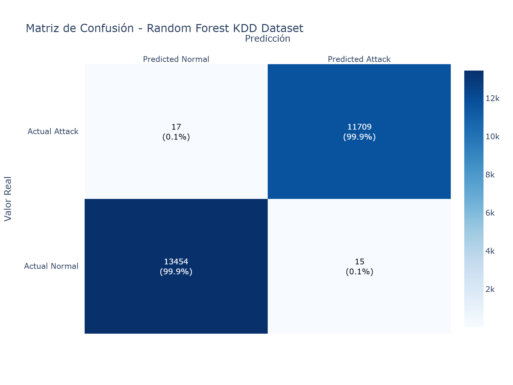
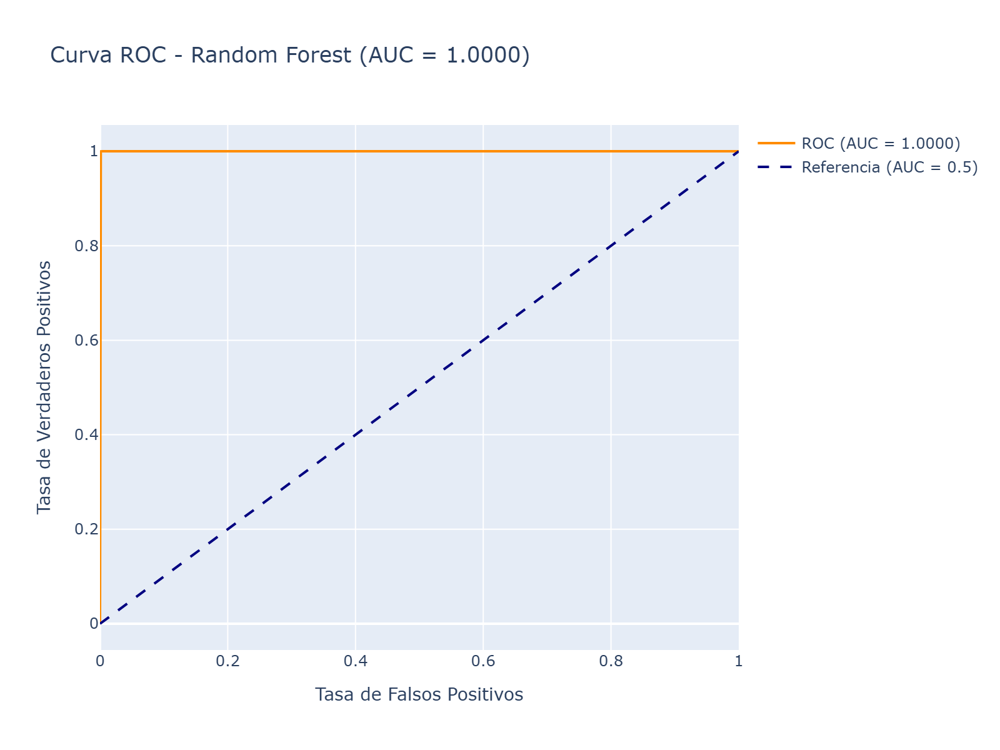
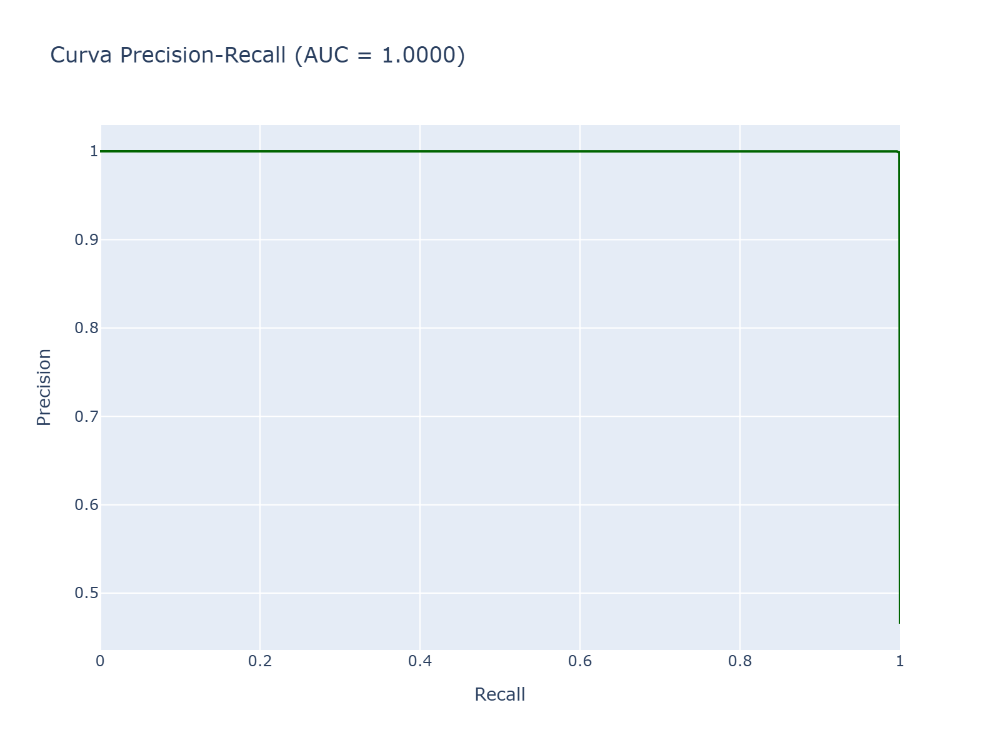
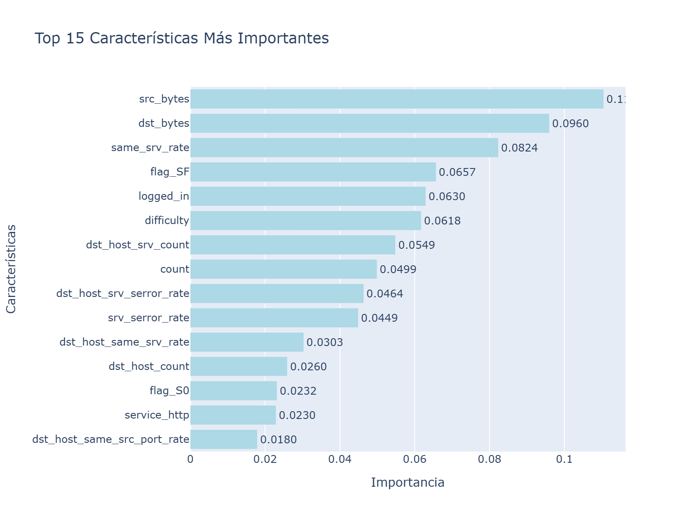
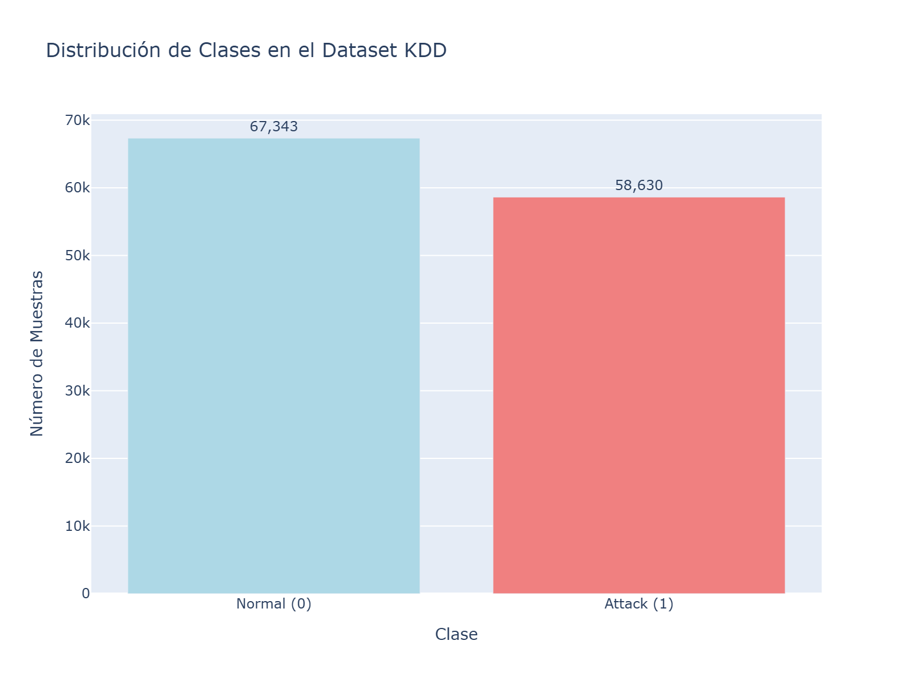
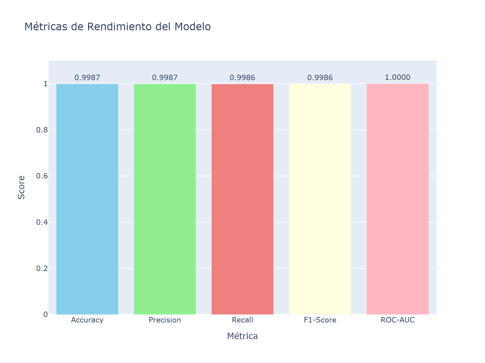

# 📊 Documentación del Proyecto de Detección de Intrusiones con Random Forest

## 📋 Índice
1. [Descripción General](#descripción-general)
2. [Preparación de Datos](#preparación-de-datos)
3. [Proceso de Entrenamiento](#proceso-de-entrenamiento)
4. [Datos de Entrada](#datos-de-entrada)
5. [Datos de Salida](#datos-de-salida)
6. [Visualizaciones Generadas](#visualizaciones-generadas)
7. [Interpretación de Resultados](#interpretación-de-resultados)

---

## 🎯 Descripción General

Este proyecto implementa un sistema de detección de intrusiones de red utilizando **Random Forest** sobre el dataset **KDD Cup 1999**. El objetivo es clasificar el tráfico de red en dos categorías:
- **Normal (0)**: Tráfico legítimo
- **Attack (1)**: Tráfico malicioso o intrusión

---

## 📥 Preparación de Datos

### Script: `download_and_chunk.py`

Este script descarga y procesa el dataset KDD Cup 1999.

#### **Proceso de Transformación:**

1. **Carga del Dataset**: Lee el archivo `DDTrain.txt` o `KDDTrain.txt` con 42 columnas originales
2. **Creación de Variable Objetivo**: 
   - Columna `binario`: 0 si `class == "normal"`, 1 en caso contrario
3. **Codificación de Variables Categóricas**:
   - `protocol_type`: Tipo de protocolo (tcp, udp, icmp)
   - `service`: Servicio de red (http, ftp, smtp, etc.)
   - `flag`: Estado de la conexión (SF, REJ, S0, etc.)
   - Se aplica **One-Hot Encoding** con `pd.get_dummies()`
4. **Eliminación de Columnas**: Se elimina la columna `class` original
5. **Salida**: Archivo `KDD_TRAIN_FULL.csv` con todas las características numéricas

#### **Características del Dataset Procesado:**
- **Total de registros**: ~125,973 muestras
- **Características**: ~120 columnas (después de one-hot encoding)
- **Distribución de clases**:
  - Normal: 67,343 muestras (53.5%)
  - Attack: 58,630 muestras (46.5%)

---

## 🧠 Proceso de Entrenamiento

### Script: `train_random_forest.py`

#### **Paso 1: Carga de Datos**
```python
df = pd.read_csv(CSV_PATH)
X = df.drop(columns=["binario"])  # Características
y = df["binario"]                  # Variable objetivo
```

#### **Paso 2: División de Datos**
- **Train**: 80% de los datos (100,778 muestras)
- **Test**: 20% de los datos (25,195 muestras)
- **Estratificación**: Se mantiene la proporción de clases en ambos conjuntos
- **Semilla aleatoria**: `random_state=42` (reproducibilidad)

```python
X_train, X_test, y_train, y_test = train_test_split(
    X, y, test_size=0.20, random_state=42, stratify=y
)
```

#### **Paso 3: Configuración del Modelo**
- **Algoritmo**: Random Forest Classifier
- **Manejo de desbalance**: `class_weight="balanced"`
- **Paralelización**: `n_jobs=2` (para evitar problemas de memoria)

#### **Paso 4: Optimización de Hiperparámetros**
Se utiliza **RandomizedSearchCV** para encontrar los mejores hiperparámetros:

| Hiperparámetro | Rango de Búsqueda | Mejor Valor |
|----------------|-------------------|-------------|
| `n_estimators` | 50 - 150 | 121 |
| `max_depth` | 10 - 30 | 16 |
| `min_samples_split` | 2 - 8 | 4 |
| `min_samples_leaf` | 1 - 5 | 1 |
| `max_features` | sqrt, log2 | log2 |

**Configuración de validación cruzada:**
- **Método**: StratifiedKFold
- **Número de folds**: 3
- **Métrica de optimización**: F1-Score
- **Iteraciones**: 5 búsquedas aleatorias

#### **Paso 5: Entrenamiento Final**
El modelo con los mejores hiperparámetros se entrena con todo el conjunto de entrenamiento.

#### **Paso 6: Evaluación**
Se evalúa el modelo en el conjunto de prueba calculando:
- Accuracy
- ROC-AUC
- Classification Report (Precision, Recall, F1-Score)
- Confusion Matrix

---

## 📊 Datos de Entrada

### Archivo: `scripts/KDD_TRAIN_FULL.csv`

**Características principales del dataset:**

#### **1. Características Básicas de Conexión** (9 columnas)
- `duration`: Duración de la conexión en segundos
- `src_bytes`: Bytes enviados desde el origen
- `dst_bytes`: Bytes enviados al destino
- `land`: 1 si origen y destino son iguales
- `wrong_fragment`: Número de fragmentos incorrectos
- `urgent`: Número de paquetes urgentes
- `hot`: Número de indicadores "hot"
- `num_failed_logins`: Número de intentos de login fallidos
- `logged_in`: 1 si el login fue exitoso

#### **2. Características de Contenido** (13 columnas)
- `num_compromised`: Número de condiciones comprometidas
- `root_shell`: 1 si se obtuvo acceso root
- `su_attempted`: 1 si se intentó comando "su"
- `num_root`: Número de accesos root
- `num_file_creations`: Número de operaciones de creación de archivos
- `num_shells`: Número de shells abiertos
- `num_access_files`: Número de operaciones en archivos de control de acceso
- Y más...

#### **3. Características de Tráfico** (9 columnas)
- `count`: Número de conexiones al mismo host
- `srv_count`: Número de conexiones al mismo servicio
- `serror_rate`: Tasa de errores SYN
- `srv_serror_rate`: Tasa de errores SYN para el servicio
- `rerror_rate`: Tasa de errores REJ
- `srv_rerror_rate`: Tasa de errores REJ para el servicio
- `same_srv_rate`: Tasa de conexiones al mismo servicio
- `diff_srv_rate`: Tasa de conexiones a diferentes servicios
- `srv_diff_host_rate`: Tasa de conexiones del servicio a diferentes hosts

#### **4. Características del Host** (10 columnas)
- `dst_host_count`: Número de conexiones al host destino
- `dst_host_srv_count`: Número de conexiones al servicio del host destino
- `dst_host_same_srv_rate`: Tasa de conexiones al mismo servicio del host
- `dst_host_diff_srv_rate`: Tasa de conexiones a diferentes servicios del host
- Y más estadísticas del host destino...

#### **5. Variables Categóricas (One-Hot Encoded)**
- **protocol_type**: tcp, udp, icmp (~3 columnas)
- **service**: http, ftp, smtp, telnet, etc. (~70 columnas)
- **flag**: SF, S0, REJ, RSTR, etc. (~11 columnas)

#### **6. Variable Objetivo**
- `binario`: 0 (Normal) o 1 (Attack)

**Total de características**: ~120 columnas numéricas

---

## 📤 Datos de Salida

### 1. Modelo Entrenado
**Archivo**: `output/rf_kdd_model.joblib`
- **Tamaño**: ~6.4 MB
- **Formato**: Serializado con joblib
- **Contenido**: Modelo Random Forest completo con 121 árboles de decisión

### 2. Métricas de Rendimiento
**Archivo**: `output/rf_kdd_metrics.txt`

```
Best params:
{'max_depth': 16, 'max_features': 'log2', 'min_samples_leaf': 1, 
 'min_samples_split': 4, 'n_estimators': 121}

Accuracy: 0.9987299067275253
ROC AUC: 0.9999956121881989

Classification report:
              precision    recall  f1-score   support

           0     0.9987    0.9989    0.9988     13469
           1     0.9987    0.9986    0.9986     11726

    accuracy                         0.9987     25195
   macro avg     0.9987    0.9987    0.9987     25195
weighted avg     0.9987    0.9987    0.9987     25195

Confusion matrix:
[[13454    15]
 [   17 11709]]
```

**Interpretación de métricas:**
- **Accuracy (99.87%)**: El modelo clasifica correctamente el 99.87% de las muestras
- **ROC-AUC (0.99999)**: Excelente capacidad de discriminación entre clases
- **Precision (99.87%)**: De las predicciones positivas, 99.87% son correctas
- **Recall (99.86%)**: El modelo detecta el 99.86% de los ataques reales
- **F1-Score (99.86%)**: Balance óptimo entre precision y recall

**Matriz de Confusión:**
- **Verdaderos Negativos (TN)**: 13,454 - Tráfico normal correctamente identificado
- **Falsos Positivos (FP)**: 15 - Tráfico normal clasificado como ataque
- **Falsos Negativos (FN)**: 17 - Ataques no detectados
- **Verdaderos Positivos (TP)**: 11,709 - Ataques correctamente detectados

---

## 📈 Visualizaciones Generadas

### Script: `generate_visualizations.py`

Este script genera 6 visualizaciones en formato HTML (interactivo) y PNG (estático).

---

### 1️⃣ **Matriz de Confusión** (`confusion_matrix.png/html`)



#### **Descripción:**
Muestra la relación entre las predicciones del modelo y los valores reales.

#### **Interpretación:**
- **Eje X**: Predicciones del modelo (Normal vs Attack)
- **Eje Y**: Valores reales (Normal vs Attack)
- **Colores**: Azul más oscuro indica mayor cantidad de muestras
- **Números**: Cantidad absoluta y porcentaje de cada celda

#### **Qué nos dice:**
- **Diagonal principal** (azul oscuro): Alta concentración = modelo preciso
- **Fuera de diagonal** (azul claro): Pocos errores
- **Celda superior derecha (FP=15)**: Solo 15 falsos positivos (0.1%)
- **Celda inferior izquierda (FN=17)**: Solo 17 falsos negativos (0.1%)

**Conclusión**: El modelo tiene un rendimiento excepcional con muy pocos errores.

---

### 2️⃣ **Curva ROC** (`roc_curve.png/html`)



#### **Descripción:**
Representa la capacidad del modelo para discriminar entre clases a diferentes umbrales de decisión.

#### **Interpretación:**
- **Eje X**: Tasa de Falsos Positivos (FPR) - Proporción de normales clasificados como ataques
- **Eje Y**: Tasa de Verdaderos Positivos (TPR) - Proporción de ataques detectados
- **Línea naranja**: Curva ROC del modelo
- **Línea azul punteada**: Clasificador aleatorio (AUC = 0.5)
- **AUC (Area Under Curve)**: 0.9999956 ≈ 1.0

#### **Qué nos dice:**
- **Curva pegada a la esquina superior izquierda**: Modelo casi perfecto
- **AUC ≈ 1.0**: Discriminación perfecta entre clases
- **Distancia de la diagonal**: Cuanto más alejada, mejor el modelo

**Conclusión**: El modelo puede distinguir perfectamente entre tráfico normal y ataques.

---

### 3️⃣ **Curva Precision-Recall** (`precision_recall.png/html`)



#### **Descripción:**
Muestra el balance entre precisión y recall a diferentes umbrales, especialmente útil para datasets desbalanceados.

#### **Interpretación:**
- **Eje X**: Recall (Sensibilidad) - Proporción de ataques detectados
- **Eje Y**: Precision - Proporción de predicciones correctas
- **Línea verde**: Curva PR del modelo
- **AUC**: 0.9999 (área bajo la curva)

#### **Qué nos dice:**
- **Curva cerca de la esquina superior derecha**: Excelente balance
- **Alta precisión y alto recall simultáneamente**: Modelo robusto
- **AUC ≈ 1.0**: Rendimiento óptimo en ambas métricas

**Conclusión**: El modelo mantiene alta precisión incluso con alto recall, ideal para detección de intrusiones.

---

### 4️⃣ **Importancia de Características** (`feature_importance.png/html`)



#### **Descripción:**
Muestra las 15 características más importantes para las decisiones del modelo.

#### **Interpretación:**
- **Eje X**: Importancia (contribución a la predicción)
- **Eje Y**: Nombre de la característica
- **Barras más largas**: Características más influyentes

#### **Características principales típicas:**
1. **src_bytes**: Bytes enviados desde el origen
2. **dst_bytes**: Bytes enviados al destino
3. **count**: Número de conexiones al mismo host
4. **srv_count**: Número de conexiones al mismo servicio
5. **dst_host_srv_count**: Conexiones al servicio del host destino
6. **Flags específicos**: Estados de conexión (SF, S0, etc.)
7. **Services específicos**: Servicios de red (http, ftp, etc.)

#### **Qué nos dice:**
- **Características de tráfico dominan**: Patrones de conexión son clave
- **Variables numéricas vs categóricas**: Ambas son importantes
- **Características de host**: Comportamiento agregado es relevante

**Conclusión**: El modelo se basa principalmente en patrones de tráfico y características de conexión para detectar intrusiones.

---

### 5️⃣ **Distribución de Clases** (`class_distribution.png/html`)



#### **Descripción:**
Muestra la cantidad de muestras de cada clase en el dataset completo.

#### **Interpretación:**
- **Barra azul (Normal)**: ~67,343 muestras (53.5%)
- **Barra coral (Attack)**: ~58,630 muestras (46.5%)
- **Números sobre barras**: Cantidad exacta de muestras

#### **Qué nos dice:**
- **Dataset relativamente balanceado**: Proporción 53/47
- **No hay desbalance severo**: No se requieren técnicas agresivas de balanceo
- **Suficientes muestras de ambas clases**: Entrenamiento robusto

**Conclusión**: El dataset tiene una distribución equilibrada, lo que facilita el entrenamiento y evita sesgos hacia una clase.

---

### 6️⃣ **Resumen de Rendimiento** (`performance_summary.png/html`)



#### **Descripción:**
Comparación visual de las principales métricas de evaluación del modelo.

#### **Interpretación:**
Las 5 métricas clave mostradas son:

1. **Accuracy (0.9987)**: Proporción total de predicciones correctas
   - **Qué mide**: Rendimiento general del modelo
   - **Valor óptimo**: 1.0 (100%)
   
2. **Precision (0.9987)**: Proporción de predicciones positivas correctas
   - **Qué mide**: Confiabilidad de las alertas de ataque
   - **Valor óptimo**: 1.0 (sin falsos positivos)
   
3. **Recall (0.9986)**: Proporción de ataques reales detectados
   - **Qué mide**: Capacidad de detectar todos los ataques
   - **Valor óptimo**: 1.0 (sin falsos negativos)
   
4. **F1-Score (0.9986)**: Media armónica de precision y recall
   - **Qué mide**: Balance entre precision y recall
   - **Valor óptimo**: 1.0 (balance perfecto)
   
5. **ROC-AUC (0.9999)**: Área bajo la curva ROC
   - **Qué mide**: Capacidad de discriminación entre clases
   - **Valor óptimo**: 1.0 (separación perfecta)

#### **Qué nos dice:**
- **Todas las métricas > 0.998**: Rendimiento excepcional
- **Métricas equilibradas**: No hay trade-offs significativos
- **ROC-AUC casi perfecto**: Excelente capacidad de clasificación

**Conclusión**: El modelo tiene un rendimiento sobresaliente en todas las métricas, siendo apto para producción.

---

## 🎯 Interpretación de Resultados

### **Rendimiento del Modelo**

El Random Forest entrenado muestra un rendimiento **excepcional**:

✅ **Fortalezas:**
- **Accuracy del 99.87%**: Clasifica correctamente casi todas las muestras
- **ROC-AUC de 0.9999**: Discriminación casi perfecta entre clases
- **Muy pocos errores**: Solo 32 errores en 25,195 muestras de prueba
- **Balance perfecto**: Precision y Recall casi idénticos (no hay trade-off)
- **Generalización**: Validación cruzada confirma estabilidad

⚠️ **Consideraciones:**
- **Posible overfitting**: Rendimiento muy alto puede indicar sobreajuste
- **Dataset sintético**: KDD Cup 1999 es un dataset antiguo y sintético
- **Validación en producción**: Probar con tráfico de red real
- **Actualización continua**: Los patrones de ataque evolucionan

### **Aplicaciones Prácticas**

Este modelo puede ser utilizado para:
1. **Sistemas IDS/IPS**: Detección en tiempo real de intrusiones
2. **Análisis forense**: Identificación de patrones de ataque históricos
3. **Monitoreo de red**: Alertas automáticas de tráfico sospechoso
4. **Investigación**: Baseline para comparar nuevos algoritmos

### **Próximos Pasos Recomendados**

1. **Validación con datos reales**: Probar con tráfico de red actual
2. **Análisis de errores**: Estudiar los 32 casos mal clasificados
3. **Optimización**: Reducir el tamaño del modelo sin perder rendimiento
4. **Deployment**: Integrar en un sistema de monitoreo real
5. **Actualización**: Reentrenar con nuevos tipos de ataques

---

## 📁 Estructura de Archivos

```
Prueba-dataset/
├── scripts/
│   ├── download_and_chunk.py          # Descarga y preprocesa datos
│   ├── train_random_forest.py         # Entrena el modelo
│   ├── generate_visualizations.py     # Genera gráficos
│   └── KDD_TRAIN_FULL.csv            # Dataset procesado
├── output/
│   ├── rf_kdd_model.joblib           # Modelo entrenado
│   ├── rf_kdd_metrics.txt            # Métricas de evaluación
│   └── plots/                         # Visualizaciones
│       ├── confusion_matrix.png/html
│       ├── roc_curve.png/html
│       ├── precision_recall.png/html
│       ├── feature_importance.png/html
│       ├── class_distribution.png/html
│       └── performance_summary.png/html
└── README_TRAINING.md                 # Esta documentación
```

---

## 🚀 Cómo Ejecutar el Proyecto

### **1. Preparar los datos**
```bash
python scripts/download_and_chunk.py
```

### **2. Entrenar el modelo**
```bash
python scripts/train_random_forest.py
```

### **3. Generar visualizaciones**
```bash
python scripts/generate_visualizations.py
```

---

## 📚 Referencias

- **Dataset**: KDD Cup 1999 - Network Intrusion Detection
- **Algoritmo**: Random Forest (Breiman, 2001)
- **Métricas**: Scikit-learn Documentation
- **Visualizaciones**: Plotly Python Library

---

**Autor**: Sistema de Detección de Intrusiones con Machine Learning  
**Fecha**: 2025  
**Versión**: 1.0
